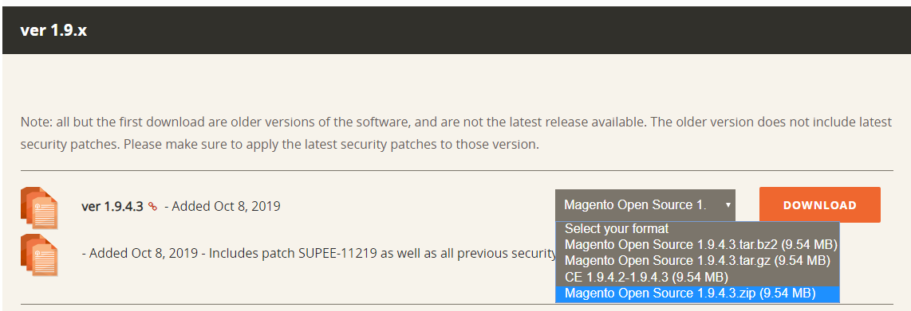
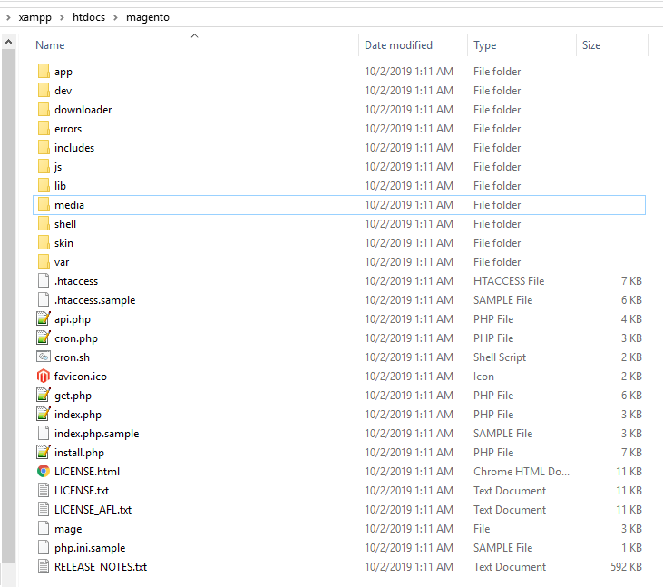
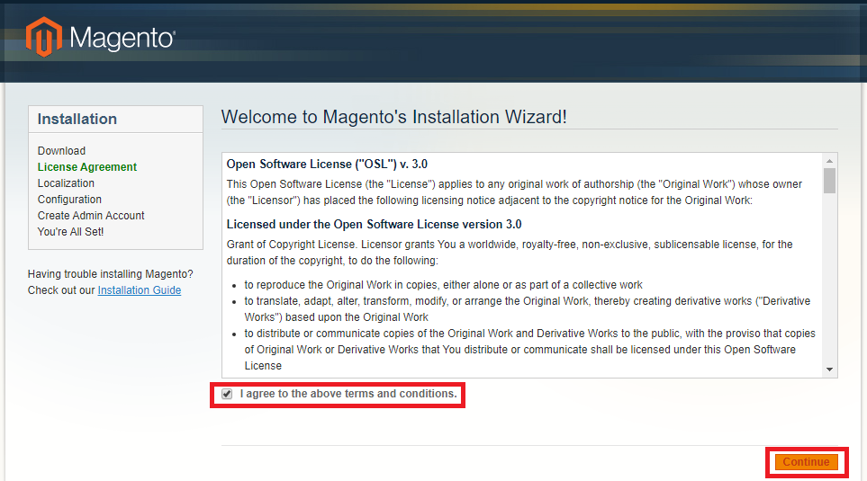
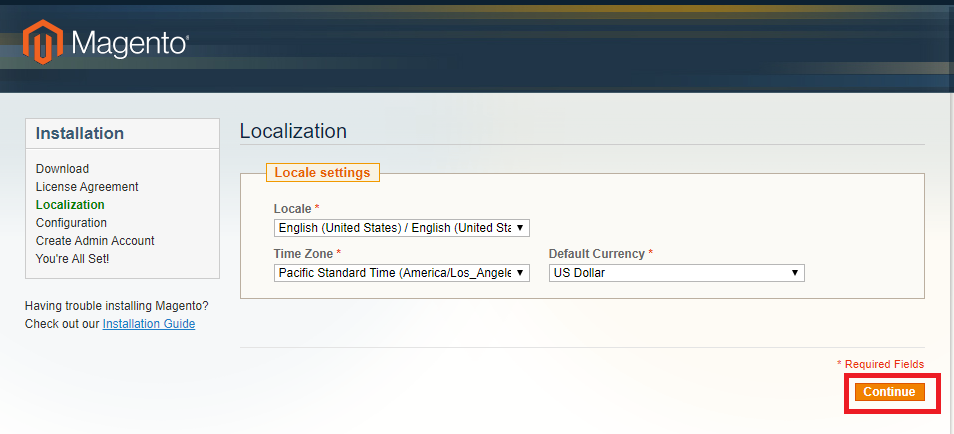
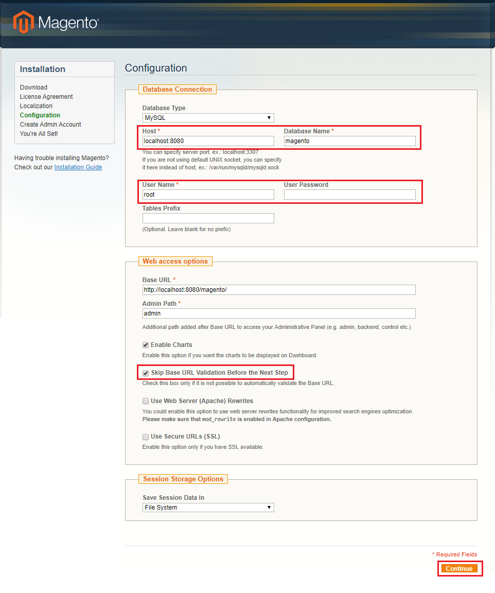
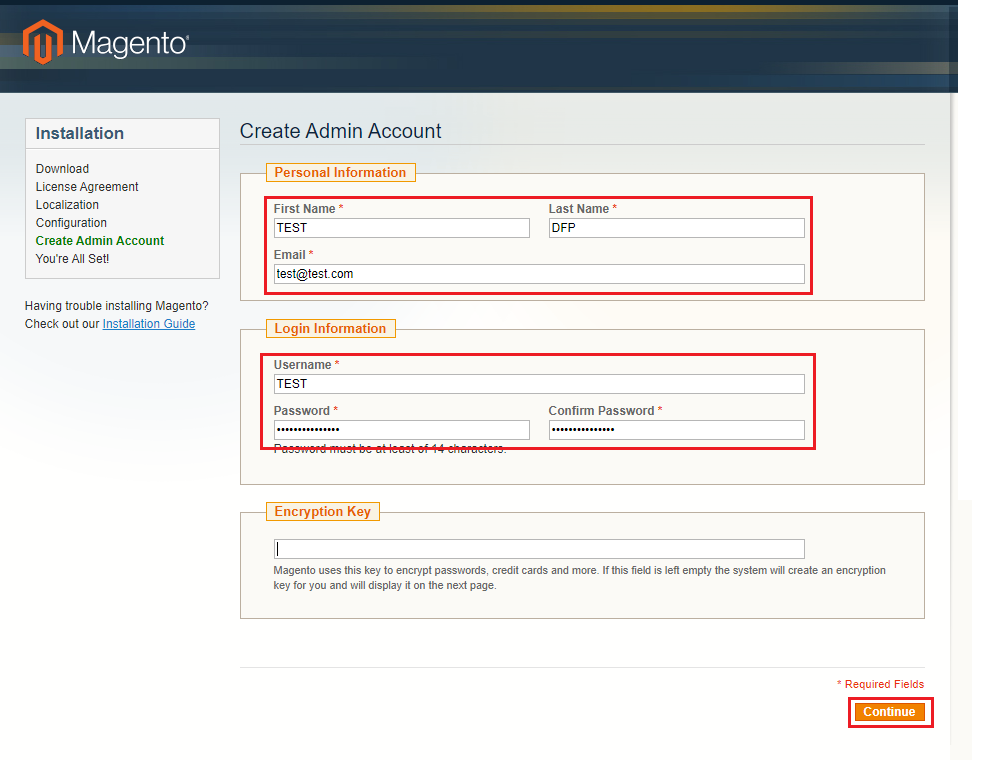
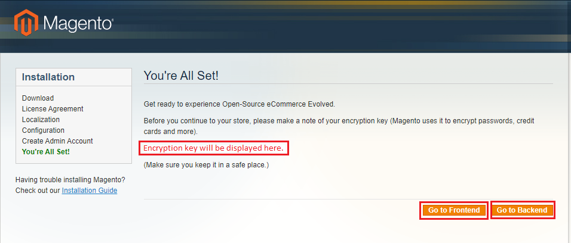
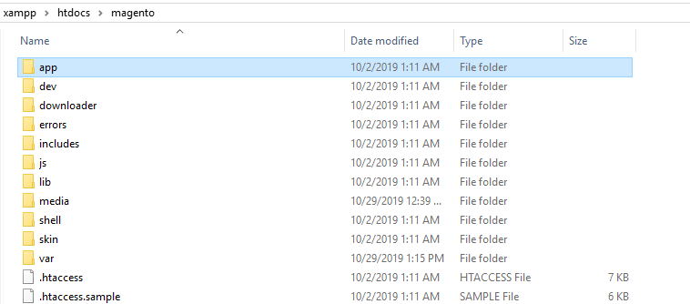
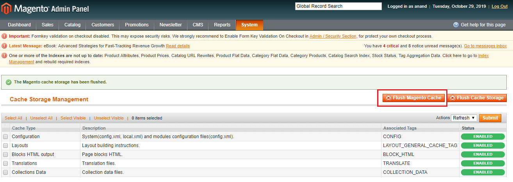
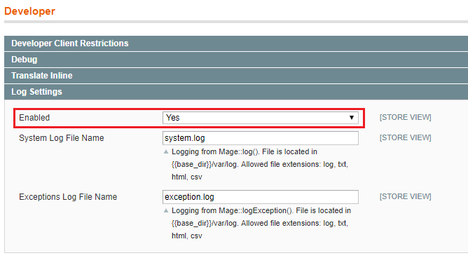

# Microsoft Dynamics 365 Fraud Protection - Magento sample merchant application
The Microsoft Dynamics 365 Fraud Protection sample for [Adobe Magento](https://www.adobe.com/commerce/magento.html) demonstrates how to integrate and call the [Dynamics 365 Fraud Protection APIs](https://apidocs.microsoft.com/services/dynamics365fraudprotection) for merchants using the Adobe Magento eCommerce platform.

It demonstrates the primary uses of the Dynamics 365 Fraud Protection APIs:
- Requesting a Dynamics 365 Fraud Protection risk recommendation for purchases and using the recommendation to decide whether to charge the customer.
- Managing users and their associated information in the Dynamics 365 Fraud Protection system (for example, basic info, payment methods, addresses, and so on).
- Reporting chargebacks and refunds.

## Local development setup
Before running the solution, install these prerequisites:
- A PHP editor, such as Visual Studio Code.
- XAMPP 7.2.24 OR any compatible version supporting Magento ver 1.9.4.3.
  - Ensure the SOAP PHP extension is installed/enabled.
  - Ensure that /xampp/php/php.ini has properly set SSL bundle paths, if not already valid:
    - curl.cainfo="C:\xampp\perl\vendor\lib\Mozilla\CA\cacert.pem"
    - openssl.cafile="C:\xampp\perl\vendor\lib\Mozilla\CA\cacert.pem"

## Magento ver 1.9.4.3 setup
1. Download Magento ver 1.9.4.3 from https://magento.com/tech-resources/download

   

1. Create a folder **magento** under **c:/xampp/htdocs** and extract the downloaded zip file to the newly created **magento** folder.

   

1. Use the XAMPP Control Panel to ensure that Apache and MySQL are running.
1. Open **phpMyAdmin** - [http://localhost/phpmyadmin](http://localhost/phpmyadmin) - and create the **magento** database.

   

1. Complete Magento installation:
   1. Go to [http://localhost/magento/index.php/install/](http://localhost/magento/index.php/install/)
   1. Read and accept the terms and condition.

      

   1. Select appropriate **Locale settings** and click on **Continue** button.

      

   1. Input the configuration values below and click **Continue**
      1. **Host** - localhost
      1. **Database Name** – magento (Same name as created in step 4)
      1. **User Name** – root, or create a new user in PhpMyAdmin for Magento.
      1. **User Password** – BLANK (NO value), or use the new user's password.
      1. **Base URL** - For local development, it's recommended to do HOSTS file mapping to create a local name to run Magento on. For instance, hosts map 'store' to 127.0.0.1 in your HOSTs file and then setup Magento at: http://store/magento. See [https://magento.stackexchange.com/a/80377](https://magento.stackexchange.com/a/80377) for more. If Magento complains about an invalid URL, see [https://stackoverflow.com/a/32132889](https://stackoverflow.com/a/32132889) for more. 
      1. Check **Skip Base URL Validation Before the Next Step** checkbox

             

    1. Create Admin Account. This admin account will be used to log into Magento Admin application.

       

    1. Please make a note of your encryption key. Click on Go to Frontend and Go to Backend buttons.

       

## Dynamics 365 Fraud Protection Local Module setup
1. Clone or download this repo’s code.
1. Copy the '**src**' folder’s contents into the **xampp\htdocs\magento\app** folder.

   

1. Log in to the Admin Panel [http://127.0.0.1/magento/index.php/admin/](http://127.0.0.1/magento/index.php/admin/) and configure Dynamics 365 Fraud Protection settings.
   1. Navigate to **System -> Cache management** and Flush Magento Cache.
   
      

   1. Logout of the admin account and log back in or you may receive an error when saving the configuration in the next step.

   1. Navigate to **System -> Configuration** and configure Dynamics 365 Fraud Protection:
      1. **Purchase Assessment Type** – select Protect or Evaluate
      1. **Client ID** - Client ID created for authentication.
      1. **Client Secret** - Client secret value for authentication 
      1. **API Resource URI** - https://api.dfp.dynamics-int.com or https://api.dfp.dynamics.com depending on environment.
      1. **Base URL** – "Merchant API Endpoint" from your Dynamics 365 Fraud Protection dashboard.
      1. **Purchase** – /v1.0/MerchantServices/events/Purchase
      1. **Purchase Status** – /v1.0/MerchantServices/events/PurchaseStatus
      1. **Bank Event** – /v1.0/MerchantServices/events/BankEvent
      1. **Chargeback** – /v1.0/MerchantServices/events/Chargeback
      1. **Refund** – /v1.0/MerchantServices/events/Refund
      1. **Update Account** - /v1.0/MerchantServices/events/UpdateAccount
1. Enable "Saved Credit Cards" payment method part 1:
   1. Add the code below inside the **xampp\htdocs\magento\app\code\core\Mage\Payment\etc\config.xml** under the &lt;default&gt;/&lt;payment&gt; node:

        ```xml
        <ccsave>
            <active>1</active>
            <cctypes>AE,VI,MC,DI</cctypes>
            <model>payment/method_ccsave</model>
            <order_status>pending</order_status>
            <title>Credit Card (saved)</title>
            <allowspecific>0</allowspecific>
            <group>offline</group>
        </ccsave>
        ```

   1. Add the code below inside **xampp\htdocs\magento\app\code\core\Mage\Payment\etc\system.xml** under the &lt;config&gt;/&lt;sections&gt;/&lt;payment&gt;/&lt;groups&gt; node:

        ```xml
        <ccsave translate="label">
            <label>Saved CC</label>
            <frontend_type>text</frontend_type>
            <sort_order>27</sort_order>
            <show_in_default>1</show_in_default>
            <show_in_website>1</show_in_website>
            <show_in_store>1</show_in_store>
            <fields>
            <active translate="label">
                <label>Enabled</label>
                <frontend_type>select</frontend_type>
                <source_model>adminhtml/system_config_source_yesno</source_model>
                <sort_order>1</sort_order>
                <show_in_default>1</show_in_default>
                <show_in_website>1</show_in_website>
                <show_in_store>0</show_in_store>
            </active>
            <cctypes translate="label">
                <label>Credit Card Types</label>
                <frontend_type>multiselect</frontend_type>
                <source_model>adminhtml/system_config_source_payment_cctype</source_model>
                <sort_order>4</sort_order>
                <show_in_default>1</show_in_default>
                <show_in_website>1</show_in_website>
                <show_in_store>0</show_in_store>
                <can_be_empty>1</can_be_empty>
            </cctypes>
            <order_status translate="label">
                <label>New Order Status</label>
                <frontend_type>select</frontend_type>
                <source_model>adminhtml/system_config_source_order_status_new</source_model>
                <sort_order>2</sort_order>
                <show_in_default>1</show_in_default>
                <show_in_website>1</show_in_website>
                <show_in_store>0</show_in_store>
            </order_status>
            <sort_order translate="label">
                <label>Sort Order</label>
                <frontend_type>text</frontend_type>
                <sort_order>100</sort_order>
                <show_in_default>1</show_in_default>
                <show_in_website>1</show_in_website>
                <show_in_store>0</show_in_store>
                <frontend_class>validate-number</frontend_class>
            </sort_order>
            <title translate="label">
                <label>Title</label>
                <frontend_type>text</frontend_type>
                <sort_order>1</sort_order>
                <show_in_default>1</show_in_default>
                <show_in_website>1</show_in_website>
                <show_in_store>1</show_in_store>
            </title>
            <useccv translate="label">
                <label>Request Card Security Code</label>
                <frontend_type>select</frontend_type>
                <source_model>adminhtml/system_config_source_yesno</source_model>
                <sort_order>5</sort_order>
                <show_in_default>1</show_in_default>
                <show_in_website>1</show_in_website>
                <show_in_store>0</show_in_store>
            </useccv>
            <centinel translate="label">
                <label>3D Secure Card Validation</label>
                <frontend_type>select</frontend_type>
                <source_model>adminhtml/system_config_source_yesno</source_model>
                <sort_order>20</sort_order>
                <show_in_default>1</show_in_default>
                <show_in_website>1</show_in_website>
                <show_in_store>0</show_in_store>
            </centinel>
            <centinel_is_mode_strict translate="label comment">
                <label>Severe 3D Secure Card Validation</label>
                <comment>Severe validation removes chargeback liability on merchant.</comment>
                <frontend_type>select</frontend_type>
                <source_model>adminhtml/system_config_source_yesno</source_model>
                <sort_order>25</sort_order>
                <show_in_default>1</show_in_default>
                <show_in_website>1</show_in_website>
                <show_in_store>0</show_in_store>
                <depends>
                <centinel>1</centinel>
                </depends>
            </centinel_is_mode_strict>
            <centinel_api_url translate="label comment">
                <label>Centinel API URL</label>
                <comment>A value is required for live mode. Refer to your CardinalCommerce agreement.</comment>
                <frontend_type>text</frontend_type>
                <source_model>adminhtml/system_config_source_yesno</source_model>
                <sort_order>30</sort_order>
                <show_in_default>1</show_in_default>
                <show_in_website>1</show_in_website>
                <show_in_store>0</show_in_store>
                <depends>
                <centinel>1</centinel>
                </depends>
            </centinel_api_url>
            <allowspecific translate="label">
                <label>Payment from Applicable Countries</label>
                <frontend_type>allowspecific</frontend_type>
                <sort_order>50</sort_order>
                <source_model>adminhtml/system_config_source_payment_allspecificcountries</source_model>
                <show_in_default>1</show_in_default>
                <show_in_website>1</show_in_website>
                <show_in_store>0</show_in_store>
            </allowspecific>
            <specificcountry translate="label">
                <label>Payment from Specific Countries</label>
                <frontend_type>multiselect</frontend_type>
                <sort_order>51</sort_order>
                <source_model>adminhtml/system_config_source_country</source_model>
                <show_in_default>1</show_in_default>
                <show_in_website>1</show_in_website>
                <show_in_store>0</show_in_store>
                <can_be_empty>1</can_be_empty>
            </specificcountry>
            <min_order_total translate="label">
                <label>Minimum Order Total</label>
                <frontend_type>text</frontend_type>
                <sort_order>98</sort_order>
                <show_in_default>1</show_in_default>
                <show_in_website>1</show_in_website>
                <show_in_store>0</show_in_store>
            </min_order_total>
            <max_order_total translate="label">
                <label>Maximum Order Total</label>
                <frontend_type>text</frontend_type>
                <sort_order>99</sort_order>
                <show_in_default>1</show_in_default>
                <show_in_website>1</show_in_website>
                <show_in_store>0</show_in_store>
            </max_order_total>
            <model>
            </model>
            </fields>
        </ccsave>
        ```

1. Enable logs. Navigate to **System -> Configuration -> Developer -> Log Settings** and set Enabled = Yes
   1. Logs for this module write to **C:\xampp\htdocs\magento\var\log\MicrosoftDFP.log**

   
   
1. Add New Order Statuses. Navigate to **System -> Order Statuses** and create the statuses below

    | Status Code    | Status Label   | Default Store View |
    |----------------|----------------|--------------------|
    | order_approved | Order Approved | Order Approved     |
    | refunded       | Refunded       | Refunded           |
    | chargeback     | Chargeback     | Chargeback         |

    

1. Assign Order Status to State. Navigate to **System -> Order Statuses** and Assign Order Status to State as below,

    | Order Status   | State |
    |----------------|-------|
    | Order Approved | New   |
    | Refunded       | New   |
    | Chargeback     | New   |
    | Canceled       | New   |

    

1. Add new Products. Navigate to **Catalog -> Manage Products** and add products as required. In addition to the required fields, ensure you update the inventory 'Qty' and 'Stock Availability' so that the product will be visible.

   

1. Add a new Sub-Category and assign products to it. Navigate to **Catalog -> Manage Categories**. Create a new **Sub Category under the Default Category** and assign products as needed.

   

1. Navigate to **System -> Cache management** and **Flush Magento Cache** again.

## Magento Test Credit Cards
See [Magento payment test credentials](https://docs.magento.com/m1/ce/user_guide/payment/test-credentials.html) for more details.

|                  | Test Value       |
|------------------|------------------|
| Visa             | 4111111111111111 |
| MasterCard       | 5555555555554444 |
| American Express | 378282246310005  |
| Expiration Date  | Any future date  |
| CVV/CVC          | 123 or 000       |

## More info
Read [integrate real-time APIs](https://go.microsoft.com/fwlink/?linkid=2085128) for general information on configuring API access.

## Product documentation
In addition to this API documentation, you can read the complimentary [product documentation for Dynamics 365 Fraud Protection](https://go.microsoft.com/fwlink/?linkid=2082391). It covers the broad set of Dynamics 365 Fraud Protection features such as the rules engine, reporting, and customer support. It also contains release notes and highlights planned, upcoming features.

## Privacy and telemetry
Once properly configured, this sample site uses Microsoft device fingerprinting to send device telemetry to Microsoft for the purposes of demonstrating Dynamics 365 Fraud Protection. To disable device fingerprinting, remove code related to it rather than configuring it. 

## Microsoft Open Source code of conduct
For additional information, see the [Microsoft Open Source Code of Conduct](https://opensource.microsoft.com/codeofconduct).